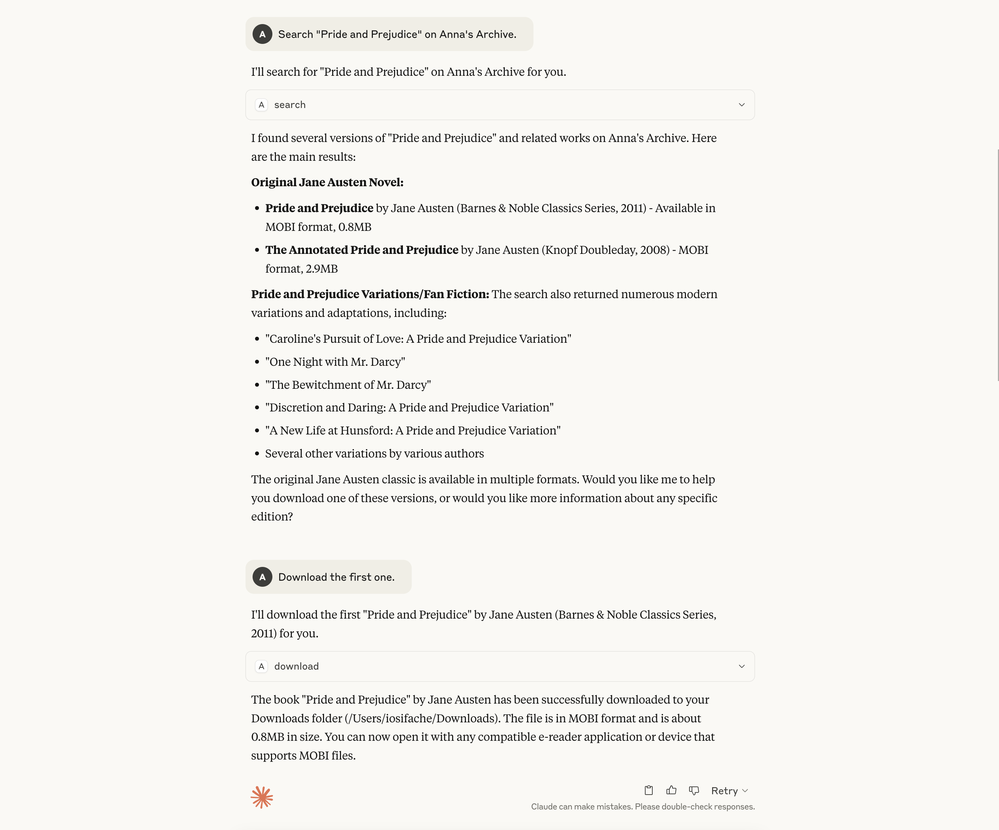
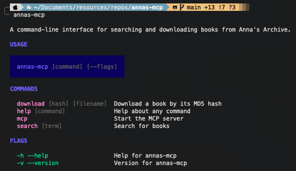

# Anna's Archive MCP Server (and CLI Tool)

[An MCP server](https://modelcontextprotocol.io/introduction) and CLI tool for searching and downloading documents from [Anna's Archive](https://annas-archive.org)

> [!NOTE]
> Notwithstanding prevailing public sentiment regarding Anna's Archive, the platform serves as a comprehensive repository for automated retrieval of documents released under permissive licensing frameworks (including Creative Commons publications and public domain materials). This software does not endorse unauthorized acquisition of copyrighted content and should be regarded solely as a utility. Users are urged to respect the intellectual property rights of authors and acknowledge the considerable effort invested in document creation.

## Available Operations

| Operation                                                                      | MCP Tool   | CLI Command |
| ------------------------------------------------------------------------------ | ---------- | ----------- |
| Search Anna's Archive for documents matching specified terms                   | `search`   | `search`    |
| Download a specific document that was previously returned by the `search` tool | `download` | `download`  |

## Requirements

If you plan to use only the CLI tool, you need:

- [A donation to Anna's Archive](https://annas-archive.org/donate), which grants JSON API access
- [An API key](https://annas-archive.org/faq#api)

If using the project as an MCP server, you also need an MCP client, such as [Claude Desktop](https://claude.ai/download).

The environment should contain two variables:

- `ANNAS_SECRET_KEY`: The API key
- `ANNAS_DOWNLOAD_PATH`: The path where the documents should be downloaded

## Setup

Download the appropriate binary from [the GitHub Releases section](https://github.com/iosifache/annas-mcp/releases).

If you plan to use the tool for its MCP server functionality, you need to integrate it into your MCP client. If you are using Claude Desktop, please consider the following example configuration:

```json
"anna-mcp": {
    "command": "/Users/iosifache/Downloads/annas-mcp",
    "args": ["mcp"],
    "env": {
        "ANNAS_SECRET_KEY": "feedfacecafebeef",
        "ANNAS_DOWNLOAD_PATH": "/Users/iosifache/Downloads"
    }
}
```

## Demo

### As an MCP Server



### As a CLI Tool


